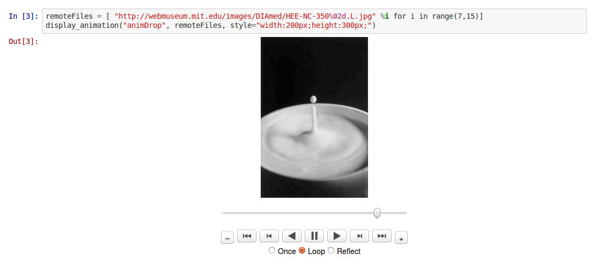

# ipython_animation_javascript_tool

This is preliminary work to display within a IPython notebook 
the JS animation tool from Jake Vanderplas (https://github.com/jakevdp/JSAnimation) 
and animate images from local directory or remote URL.

Please try from http://nbviewer.ipython.org/github/PBrockmann/ipython_animation_javascript_tool/blob/master/animation_ex01.ipynb

Note that images are not embedded into the notebook.

